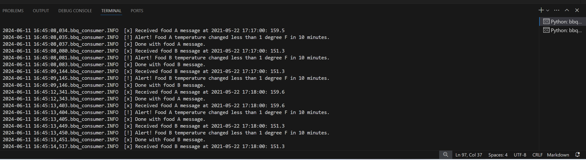
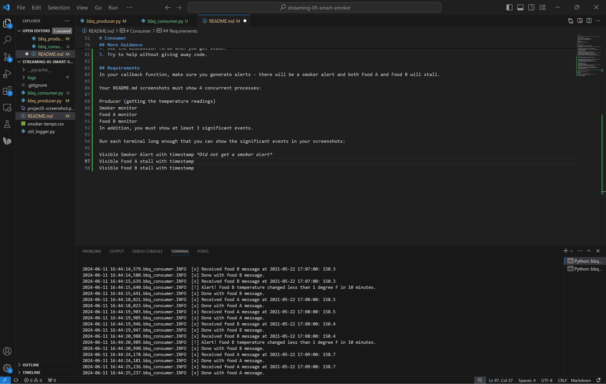

# Chelsea Brammer
## 6/2/24

# streaming-05-smart-smoker
We want to stream information from a smart smoker. Read one value every half minute. (sleep_secs = 30)

smoker-temps.csv has 4 columns:

[0] Time = Date-time stamp for the sensor reading
[1] Channel1 = Smoker Temp --> send to message queue "01-smoker"
[2] Channel2 = Food A Temp --> send to message queue "02-food-A"
[3] Channel3 = Food B Temp --> send to message queue "03-food-B"

## Requirements

RabbitMQ server running
pika installed in your active environment
RabbitMQ Admin

See http://localhost:15672/Links to an external site.

# Producer 

## General Design Questions

How many producers processes do you need to read the temperatures:
How many queues do we use: 
How many listening callback functions do we need (Hint: one per queue): 
If that is all you need to get started, you can begin the project now. Apply everything you've learned previously. 

# Before You Begin

1. In GitHub, create a new repo for your project - name it streaming-05-smart-smoker
2. Add a README.md during the creation process. (If not, you can always add it later.)
3. Clone your repo down to your machine. 
4. In VS Code, add a .gitignore (use one from an earlier module), start working on the README.md. Create it if you didn't earlier.
5. Add the csv data file to your repo. 
6. Create a file for your bbq producer.

# Design and Implement Your Producer
1. Implement your bbq producer. More detailed help provided in links below. 
2. Use the logic, approach, and structure from Module 4, version 2 and version 3.
3. These provide a current and solid foundation for streaming analytics - modifying them to serve your purpose IS part of the assignment.
4. Do not start from scratch - do not search for code - do not use a notebook.
Use comments in the code and repo to explain your work. 
5. Use docstring comments and add your name and date to your README and your code files. 
6. Explain your project in the README. Include prerequisites and how to run your code. 
7. Document your project works - display screenshots of your console and maybe the RabbitMQ console. 
8. If you only have a producer, you won't have a consumer showing messages yet, so you'll need to be creative. We'll build the consumers next.

# Consumer

## Task 1: Open Your Existing Project
1. On your machine, open your existing streaming-05-getting-started repo in VS Code.
2. Create a file for your consumer (or 3 files if you'd like to use 3 consumers).
 

## Task 2. Design and Implement Each Consumer
1. Design and implement each bbq consumer. You could have one. You could have 3.  More detailed help provided in links below. 
2. Use the logic, approach, and structure from prior modules (use the recommended versions).
3. Modifying  them to serve your purpose IS part of the assignment.
4. Do not start from scratch - do not search for code - do not use a notebook.
5. Use comments in the code and repo to explain your work. 
6. Use docstring comments and add your name and date to your README and your code files. 
 

## Professionally Present your Project
1. Explain your project in the README.
2. Include your name, date.
3. Include prerequisites and how to run your code. 
4. Explain and show how your project works. 
5. Tell us what commands are needed. Use code fencing in GitHub or backtics for inline code to share commands.
6. Display screenshots of your console with the producer and consumer running.
7. Display screenshots of at least one interesting part of the RabbitMQ console. 

## More Guidance
1. To be guided through the consumer design, read Module 6.1: Guided Consumer Design
2. For guidance on consumer implementation, read Module 6.2: Guided Consumer Implementation
3. For guidance on implementing a consumer callback, read Module 6.3: Implementing a Callback Function
4. Use the discussion forum when you get stuck.
5. Try to help without giving away code. 

## Requirements
In your callback function, make sure you generate alerts - there will be a smoker alert and both Food A and Food B will stall. 

Your README.md screenshots must show 4 concurrent processes:

Producer (getting the temperature readings)
Smoker monitor
Food A monitor
Food B monitor
In addition, you must show at least 3 significant events.

Run each terminal long enough that you can show the significant events in your screenshots:

Visible Smoker Alert with timestamp *Did not get a smoker alert*
Visible Food A stall with timestamp 

Visible Food B stall with 
